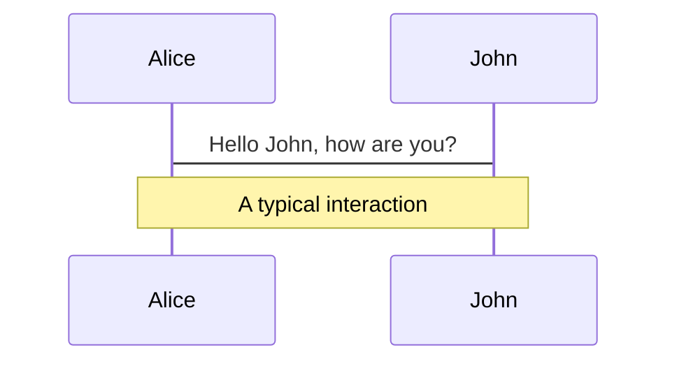
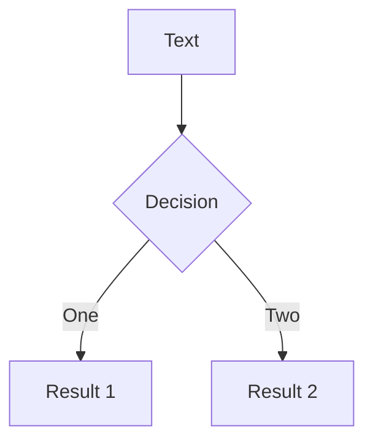
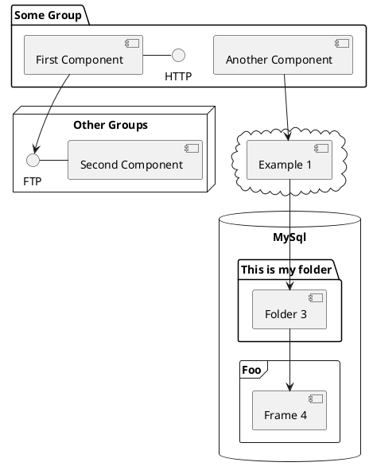

---
# try also 'default' to start simple
theme: seriph
background: https://source.unsplash.com/collection/94734566/1920x1080
class: 'text-center'
# https://sli.dev/custom/highlighters.html
highlighter: shiki
lineNumbers: false
info: |
  ## Falco
  cloud native security a observability monitoring

  Learn more at [falco.org](https://falco.org)
# persist drawings in exports and build
drawings:
  enabled: true
  persist: false
---

# Falco

Cloud native security a observability monitoring

<div class="pt-12">
  <span @click="$slidev.nav.next" class="px-2 py-1 rounded cursor-pointer" hover="bg-white bg-opacity-10">
    Dive in! <carbon:arrow-right class="inline"/>
  </span>
</div>

<!-- FIXME, add Vue Clock/watch -->

<div class="abs-br m-6 flex gap-2">
  <a href="https://github.com/epcim/slides-security-monitoring-falco" target="_blank" alt="GitHub"
    class="text-xl icon-btn opacity-50 !border-none !hover:text-white">
    <carbon-logo-github />
  </a>
</div>

<!-- 
Security monitoring byl donedávna obvykle jen o sběru všech možných logů a událostí z infrastruktury a jejich zpětné, často nepoužitelné, analýze. Implementace eBPF v linuxovém jádře ovšem otevřela platformu pro zcela jiný přístup. Observability a tracing v reálném čase při rozumných nárocích na zdroje a minimální footprint v systému. Současně se v cloud a kontejnerovém světě podstatně zvyšují nároky na zabezpečení a audit systémů. 

Přednáška je postavena na zkušenostech z implementace Falco, hardening a testování security compliance cloud systémů. Dozvíte se něco málo o základních technologiích a prostředcích security monitoringu, auditu serverů, kontejnerů a kubernetes s Falco. Konfigurace, deployment, Falco rules a vytváření vlastních pravidel. Integrace s Prometheus alertmanager. Testování a compliance fyzických i cloud serverů. Nakonec se podíváme na analytické možnosti SysFlow.io a alerting.

-->

---

<!--
<div grid="~ cols-2 gap-4">
<div>
</div>
-->
# Speaker

*Petr Michalec*

Works as SRE / DEV at F5, before Volterra.io, Mirantis, IBM, ...
n(vi)m lover. developer. geek. quad fpv pilot. thinking at the edge

- http://apealive.net/about_petr/
- http://twitter.com/epcim

<!-- FIXME, fotka v pravo od standy -->
---

# Security monitoring - purpose & requirements

Compliance with security standards:
- PCI DSS
- FIPS
- CIS
- GDPR, HIPPA, NIST, ...

Requirements:
- evidence collection
- data availability and traceablity
- processes, tools, policies
- measurements and support resources

<!--
PCI DSS - Payment Card Industry Data Security Standard
FIPS - mandatory standard for the protection of sensitive or valuable data within Federal systems
CIS - Critical Security Controls (CIS Controls)
NIST - 
HIPPA - 

--

CIS Controls are a recommended set of actions for cyber defense that provide specific and actionable ways to thwart the most pervasive attacks.

PCI DSS is set of requirements intended to ensure that all companies that process, store, or transmit credit card information maintain a secure environment. It was launched on September 7, 2006.

To become FIPS compliant, a U.S. government agency or contractor’s computer systems must meet requirements outlined in the FIPS publications numbered 140, 180, 186, 197, 198, 199, 200, 201, and 202. Introduced 2014.

FIPS 140 covers cryptographic module and testing requirements in both hardware and software.
 -->

 ---

# Security monitoring - traditional approach

<div grid="~ cols-2 gap-4">
</div>

- system/service/user audit logs, trails
- filesystem integrity
- data access & encryption
- mallicious activity detection
- security threads mittigation
  * CVEs, vulerabilitties
  * missconfiguration
- FIXME (backward) analyses and annomaly detection
- compliance checks
- reporting & alerting

Common tools:
  - auditd, aide
  - PAM, SElinux, AppArmour
  - OSSEC, OpenSCAP, Lynis
  - Fluentbit, Logtail, Vector -> S3
  - Enterprise SIEM tools
  - as-service Snyk, Whitesource, Graylog, Thread stack, ...

<!--
- configure, inpsect detect remediate alert/report
- nainstalujes, par alertu, udelat auditorra happy a sjizdis ELK
-->

---

# Security monitoring - new challenges

- containers
  - vulnerabilies in:
    - namespace isolation
    - container images
    - 3rd party libraries
- distributed applications
- cloud environments
  - AWS/GCE base images
  - 3rd party accessing servers
- data at rest

<!-- 
- distributed, logy uz nejsou na 2-3 msitech
- containers, images, binnaries & dependencies
- data nejsou jen v databazi ale v zalohach na S3 v cloud atp..

Aha, tak to je najednou nejak vic temat nez na 30min prednasku.
-->

---

# eBPF historie a implementace

- FIXME, eBPF history
- ebpf.io

SysCalls


AuditD


<!-- 
Legacy "Berkeley Packet Filter" (BPF) - technology that among other things allows programs to analyze network traffic (and eBPF is an extended BPF JIT virtual machine in the Linux kernel).

It provides a raw interface to data link layers, permitting raw link-layer packets to be sent and received, can run sandboxed programs in a privileged context.
-->


# What is eBPF


<!-- 
fIXME, eBPF popsat
-->

---

# Why eBPF?

Enhanced Telemetry Collection
- additinal kernel and syscall attributes
- additional socket info

Performance
- lower resource impact (network, files, proceses)
- avoid transfer of all audit data to userspace
- real time procesiing

eBPF Verifier
- verifies the safety of eBPF programs

<!-- 
complex development
BPF kprobes are not stable interface
new sys-calls

-->
---

# Host and contejner security monitoring with Falco

- Created by Sysdig and donated to CNCF
- [Falco.org](https://falco.org)

*Falco*, is OSS, is de-facto *Kubernetes*, *container*, *cloud* threat detection engine

"Falco is runtime security project detecting unexpected behavior, intrusions, and data theft in real time."

- host, containers, kubernetes
- out-of-the box flexible rules & languages
- container security integration 
- FIXME


<!-- 
It was created by Sysdig.
-->

# Falco Deployment

Falco driver
- Kernel module
- eBPF probe
- Userspace instrumentation (based on PTRACE2)

K8s
- Daemonset of Falco (only `falco-driver-loader` needs to be run with `securityContext: priviledged`)
- Deployment of Falco-sidekick (integration with legacy monitoring stack)
- Deployment of Falco-exporter FIXME, je to potreba ^^?
- Grafana dashboards, falco-sidekick UI


# Falco Configurace

# Falco Rules

# Prometheus integration
falcosidekick
anotace, labels, severity
# UI, Dashboards and alerting
falcosidekick UI
grafana dashboardy
alerty
# Host compliance reporting
(tohle je spis vata)
OS Hardening a konfigurace
Compliance
Filesystem integrity management
# SysFlow.io analýza a možnosti
(tohle je ted beta, budu to muset ještě rozpracovat)


---
- Falco Cloudtrail plugin can read AWS Cloudtrail logs and emit events for each Cloudtrail log entry.


---

# Learn More

[Documentation](https://falco.org/docs/getting-started/) · [GitHub](https://github.com/falcosecurity) · [Blog](https://falco.org/blog/)

## Extend

- [SysFlow](https://github.com/sysflow-telemetry)

---

---

# eBPF network observability


<!-- 
- trace TCP connect/accept and UPD connect activity
- uses telemetry from eBPF sensor to augment audit events
- reverse DNS information..
-->

--- 

# eBPF roadmap


--- 


# Sli.dev - resources & examples

Slidev is a slides maker and presenter designed for developers, consist of the following features

- 📝 **Text-based** - focus on the content with Markdown, and then style them later
- 🎨 **Themable** - theme can be shared and used with npm packages
- 🧑‍💻 **Developer Friendly** - code highlighting, live coding with autocompletion
- 🤹 **Interactive** - embedding Vue components to enhance your expressions
- 🎥 **Recording** - built-in recording and camera view
- 📤 **Portable** - export into PDF, PNGs, or even a hostable SPA
- 🛠 **Hackable** - anything possible on a webpage

<br>
<br>

Read more about [Why Slidev?](https://sli.dev/guide/why)

<!--
You can have `style` tag in markdown to override the style for the current page.
Learn more: https://sli.dev/guide/syntax#embedded-styles
-->

<style>
h1 {
  background-color: #2B90B6;
  background-image: linear-gradient(45deg, #4EC5D4 10%, #146b8c 20%);
  background-size: 100%;
  -webkit-background-clip: text;
  -moz-background-clip: text;
  -webkit-text-fill-color: transparent;
  -moz-text-fill-color: transparent;
}
</style>

---

# Navigation

Hover on the bottom-left corner to see the navigation's controls panel, [learn more](https://sli.dev/guide/navigation.html)

### Keyboard Shortcuts

|     |     |
| --- | --- |
| <kbd>right</kbd> / <kbd>space</kbd>| next animation or slide |
| <kbd>left</kbd>  / <kbd>shift</kbd><kbd>space</kbd> | previous animation or slide |
| <kbd>up</kbd> | previous slide |
| <kbd>down</kbd> | next slide |

<!-- https://sli.dev/guide/animations.html#click-animations -->

<p v-after class="absolute bottom-23 left-45 opacity-30 transform -rotate-10">Here!</p>

---
layout: image-right
image: https://source.unsplash.com/collection/94734566/1920x1080
---

# Code

Use code snippets and get the highlighting directly![^1]

```ts {all|2|1-6|9|all}
interface User {
  id: number
  firstName: string
  lastName: string
  role: string
}

function updateUser(id: number, update: User) {
  const user = getUser(id)
  const newUser = { ...user, ...update }
  saveUser(id, newUser)
}
```

<arrow v-click="3" x1="400" y1="420" x2="230" y2="330" color="#564" width="3" arrowSize="1" />

[^1]: [Learn More](https://sli.dev/guide/syntax.html#line-highlighting)

<style>
.footnotes-sep {
  @apply mt-20 opacity-10;
}
.footnotes {
  @apply text-sm opacity-75;
}
.footnote-backref {
  display: none;
}
</style>

---

# Components

<div grid="~ cols-2 gap-4">
<div>

You can use Vue components directly inside your slides.

We have provided a few built-in components like `<Tweet/>` and `<Youtube/>` that you can use directly. And adding your custom components is also super easy.

```html
<Counter :count="10" />
```

<!-- ./components/Counter.vue -->
<Counter :count="10" m="t-4" />

Check out [the guides](https://sli.dev/builtin/components.html) for more.

</div>
<div>

```html
<Tweet id="1390115482657726468" />
```

<Tweet id="1390115482657726468" scale="0.65" />

</div>
</div>


---
class: px-20
---

# Themes

Slidev comes with powerful theming support. Themes can provide styles, layouts, components, or even configurations for tools. Switching between themes by just **one edit** in your frontmatter:

<div grid="~ cols-2 gap-2" m="-t-2">

```yaml
---
theme: default
---
```

```yaml
---
theme: seriph
---
```


</div>

Read more about [How to use a theme](https://sli.dev/themes/use.html) and
check out the [Awesome Themes Gallery](https://sli.dev/themes/gallery.html).

---
preload: false
---

# Animations

Animations are powered by [@vueuse/motion](https://motion.vueuse.org/).

```html
<div
  v-motion
  :initial="{ x: -80 }"
  :enter="{ x: 0 }">
  Slidev
</div>
```

<div class="w-60 relative mt-6">
  <div class="relative w-40 h-40">
    
    
    
  </div>

  <div
    class="text-5xl absolute top-14 left-40 text-[#2B90B6] -z-1"
    v-motion
    :initial="{ x: -80, opacity: 0}"
    :enter="{ x: 0, opacity: 1, transition: { delay: 2000, duration: 1000 } }">
    Slidev
  </div>
</div>

<!-- vue script setup scripts can be directly used in markdown, and will only affects current page -->
<script setup lang="ts">
const final = {
  x: 0,
  y: 0,
  rotate: 0,
  scale: 1,
  transition: {
    type: 'spring',
    damping: 10,
    stiffness: 20,
    mass: 2
  }
}
</script>

<div
  v-motion
  :initial="{ x:35, y: 40, opacity: 0}"
  :enter="{ y: 0, opacity: 1, transition: { delay: 3500 } }">

[Learn More](https://sli.dev/guide/animations.html#motion)

</div>

---

# LaTeX

LaTeX is supported out-of-box powered by [KaTeX](https://katex.org/).

<br>

Inline $\sqrt{3x-1}+(1+x)^2$

Block
$$
\begin{array}{c}

\nabla \times \vec{\mathbf{B}} -\, \frac1c\, \frac{\partial\vec{\mathbf{E}}}{\partial t} &
= \frac{4\pi}{c}\vec{\mathbf{j}}    \nabla \cdot \vec{\mathbf{E}} & = 4 \pi \rho \\

\nabla \times \vec{\mathbf{E}}\, +\, \frac1c\, \frac{\partial\vec{\mathbf{B}}}{\partial t} & = \vec{\mathbf{0}} \\

\nabla \cdot \vec{\mathbf{B}} & = 0

\end{array}
$$

<br>

[Learn more](https://sli.dev/guide/syntax#latex)

---

# Diagrams

You can create diagrams / graphs from textual descriptions, directly in your Markdown.

<div class="grid grid-cols-3 gap-10 pt-4 -mb-6">







</div>

[Learn More](https://sli.dev/guide/syntax.html#diagrams)


---
layout: center
class: text-center
---

# Learn More

[Documentations](https://sli.dev) · [GitHub](https://github.com/slidevjs/slidev) · [Showcases](https://sli.dev/showcases.html)
