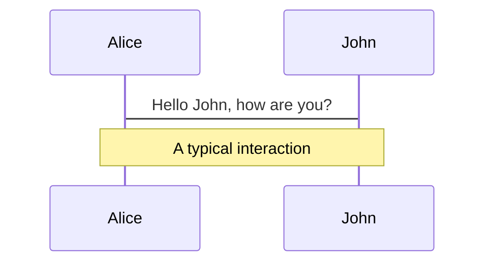
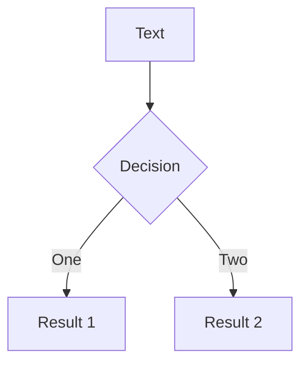
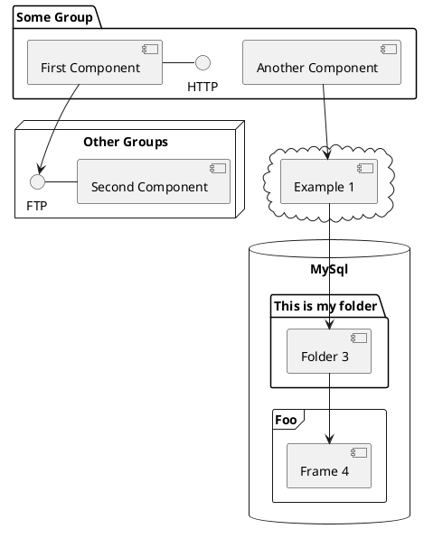

# Falco

Cloud native security a observability monitoring

<div class="pt-12">
  <span @click="$slidev.nav.next" class="px-2 py-1 rounded cursor-pointer" hover="bg-white bg-opacity-10">
    Dive in! <carbon:arrow-right class="inline"/>
  </span>
</div>

<!-- FIXME, add Vue Clock/watch -->

<div class="abs-br m-6 flex gap-2">
  <a href="https://github.com/epcim/slides-security-monitoring-falco" target="_blank" alt="GitHub"
    class="text-xl icon-btn opacity-50 !border-none !hover:text-white">
    <carbon-logo-github />
  </a>
</div>

<!-- 
Security monitoring byl donedávna obvykle jen o sběru všech možných logů a událostí z infrastruktury a jejich zpětné, často nepoužitelné, analýze. Implementace eBPF v linuxovém jádře ovšem otevřela platformu pro zcela jiný přístup. Observability a tracing v reálném čase při rozumných nárocích na zdroje a minimální footprint v systému. Současně se v cloud a kontejnerovém světě podstatně zvyšují nároky na zabezpečení a audit systémů. 

Přednáška je postavena na zkušenostech z implementace Falco, hardening a testování security compliance cloud systémů. Dozvíte se něco málo o základních technologiích a prostředcích security monitoringu, auditu serverů, kontejnerů a kubernetes s Falco. Konfigurace, deployment, Falco rules a vytváření vlastních pravidel. Integrace s Prometheus alertmanager. Testování a compliance fyzických i cloud serverů. Nakonec se podíváme na analytické možnosti SysFlow.io a alerting.

-->

---
layout: two-cols
---
# Petr Michalec
Speaker

Works as SRE / DEV at F5. Before Volterra.io, Mirantis, IBM, ...

n(vi)m lover <mdi-circle-small/> maker <mdi-circle-small/> geek <mdi-circle-small/> quad fpv pilot

<div style="color: deepskyblue">

- http://apealive.net/about_petr/
- http://twitter.com/epcim

</div>

::right::


---
layout: center
---
# Security monitoring

Purpose & requirements

<div grid="~ cols-2 gap-4">
<div>

- ...
- Compliance with security standards:
  * PCI DSS, CIS, GDPR
  * HIPPA, NIST, FIPS, FedRAMP

</div>
<div>

- evidence collection
- data availability and traceablity
- measurement and support resources
- tools, policies, processes, reporting

</div>
</div>


<!--
PCI DSS - Payment Card Industry Data Security Standard
FIPS - Mandatory standard for the protection of sensitive or valuable data within Federal systems
CIS - Critical Security Controls (CIS Controls)
NIST  - National Institute of Standards and Technology
HIPPA - US, personal informations

--

CIS Controls are a recommended set of actions for cyber defense that provide specific and actionable ways to thwart the most pervasive attacks.

PCI DSS is set of requirements intended to ensure that all companies that process, store, or transmit credit card information maintain a secure environment. It was launched on September 7, 2006.

To become FIPS compliant, a U.S. government agency or contractor’s computer systems must meet requirements outlined in the FIPS publications numbered 140, 180, 186, 197, 198, 199, 200, 201, and 202. Introduced 2014.

FIPS 140 covers cryptographic module and testing requirements in both hardware and software.
 -->

---
layout: image-right
image: /funny/camera-agent.png
---

# Security monitoring

SecOps coverage

* prevent intrusion
* detect intrusion
* configuraion encorcement
* compliance checks & reporting
* ...

<!--
Home security analogy:
Prevent intrusion               > passwords/two factor, image scanning, fw
- door lock, authz
- wiwndow sensors
- exterior camera
Detect Intrusion                > falco
- motion sensors
- interior cameras
-->
---

# Traditional approach ~2015

Topics and tools

<div grid="~ cols-2 gap-4">
<div>

  - network IDS
  - filesystem integrity
  - system/service/user audit/logs
  - data access & encryption
  - security threads, mittigation
    * CVEs, vulerabilitties
  - mallicious activity detection

</div>
<div>

  - auditd, aide
  - PAM, SElinux, AppArmour
  - OSSEC, OpenSCAP, Inspec, ...
  - Enterprise SIEM tools
  
  <br/>

  SaaS approaching (Snyk, Whitesource, Graylog, Thread stack, ...)

</div>
</div>

<!--
missconfiguration

how you collect metrics, alerts from  all of these?

signature based

nainstalujes, par alertu, udelat auditora happy a sjizdis ELK
-->

---
layout: two-cols
---

# New challenges

Microservices

**Containers**
  - namespace isolation
    - container images
      - 3rd party libraries

**Distributed applications**
  - cloud environments ^n
  - 3rd party base images for OS
  - 3rd party accessing servers

**Distributed data**

::right::


<!-- 
vulnerabilies in ...

distributed, logy uz nejsou na 2-3 msitech
data nejsou jen v databazi ale v zalohach na S3 v cloud atp..

containers, images, binnaries & dependencies
-->

---
layout: fact
---


# Falco
May 16, 2016 - Sysdig introducing open source, behavioral security


[Falco.org](https://falco.org) 'runtime security project detecting unexpected behavior, intrusions, and data theft in real time!

<!-- 
Donated to CNCF

de-facto "Kubernetes, container, cloud" threat detection engine

signature-based security monitoring  -> behavioral/"event" based approach
-->

--- 
layout: two-cols
---

# Overview
Falco

- Kernel integration

- Highly granular rules to check for activities involving 
  - file and network activity 
  - process execution 
  - IPC, ...

- Real-time metrics & notification when these rules are violated

- Less complex & faster


::right::

<div class="m-10 pt-15 center" style="color: blueviolet">

*There are a million ways a burglar can break into your home, but once they do they’re going to steal your jewelry.*

<div style="color: deepskyblue">
<br/>
...

*You only need to detect the things that an attacker does once they have access to a system, rather than all the ways an attacker can gain access to a system.*

</div>
</div>

<!-- 

Falco ~~ a mix between snort, ossec and strace
-->
---

# Comparison to existing approaches
Falco

**File integrity monitoring**: (checksums)

<div class="ml-10 center" style="color: deepskyblue">
Watch for any OS activity that is writing to a file of interest, and be alerted in real-time.
</div>
 
**Network monitoring** (signatures)

<div class="ml-10 center" style="color: deepskyblue">
Falco see I/O “from the inside” with an immediate correlation between applications and traffic.
</div>
 
Linux has multiple security modules ~ advanced access control systems with sophisticated policies and concepts. As a result, understanding and configuring them is a rather complex undertaking.

<div class="ml-10 center" style="color: deepskyblue">
Falco is far simpler to understand and configure, "detection-only".
</div>

<!--
Filesystem:

  One way to do file integrity monitoring is to periodically scan all files of interest, compute their checksums, and compare with the checksums of the previous phase.

  The challenge with this kind of approach is that it is costly to scan all files, so one typically runs it every few hours

Networking:

  IDS is inextricably tied to signatures.  With VMs and containers it has become increasingly hard to reconcile network traffic with application activity.

  You can only observe a small slice of system behavior from network traffic.

We can trace activities across all system resources - nic/application/shell/users ...

Linux has multiple security modules, notably including SELinux and AppArmor. These are extremely advanced access control systems with sophisticated policies and concepts. As a result, understanding and configuring them is a rather complex undertaking.
-->

---
layout: center
---

# How it works

Falco architecture

<div class="center">

</div>
<!--
* How do you detect "abnormal" behaviour?
* Containers are isolated processes
* Container images are immuteable, runtime environmnts - often aren't
-->

---
layout: center
---

# Kernel driver
Falco

- Built-in
- Module `falco.ko`
- eBPF probe
- Userspace instrumentation (based on PTRACE2)
<!--
Loader container:
- from pre-build sources for common kernels
- DKMS
- private location
-->

---

# eBPF

- Legacy "Berkeley Packet Filter" (BPF) - technology that among other things allows programs to analyze network traffic (and eBPF is an extended BPF JIT virtual machine in the Linux kernel).

  - raw interface to data link layers
  - permitting raw link-layer packets to be sent and received
  - can run sandboxed programs in a privileged context

<br/>
<div class="center" style="color: blueviolet">

*BPF is a highly flexible and efficient virtual machine-like construct in the Linux kernel allowing to execute bytecode at various hook points in a safe manner. It is used in number of Linux kernel subsystems (networking, tracing, security (snadboxing))"*

</div>

---
layout: two-cols
---

# SysCalls
eBPF


::right::


<!-- 

cBPF - Classic BPF, also known as "Linux Packet Filtering", introduced in 1992

eBPF - extended BPF
-->

---
layout: two-cols
---

# Why?
eBPF

Enhanced Telemetry Collection -> annotation
- kernel and syscall attributes
- socket info

Performance
- lower resource impact (network, files, proceses)
- avoid transfer of all audit data to userspace
- real time procesing

eBPF Verifier verifies the safety of eBPF programs

::right::

```
FIXME, code with example falco output
```

<!-- 
complex development

BPF kprobes are not stable interface

new sys-calls
-->

---

# Deployment

Falco components


---
layout: two-cols
---

# Deployment

Configuration

Deployment
- Falco-sidekick (exporter)
- Falco-sidekick UI
- Grafana dashboards
- ..., SysFlow, ELK
- ..., Plugins

Daemonset
- Falco \
  *(only `falco-driver-loader` needs to be run with `securityContext: priviledged`)*

::right::

<div class="pt-18">

What to enable?
- driver-loader (DKMS, private builds)
- docker, containerd, cri-o
- w/k8s metadata, audit
- custom rules
- threadiness, maxBurst, eventDrops
- priority/severity level

</div>

<!--
Falco-sidekick (integration with legacy monitoring stack)
Falco-exporter (sidekick does either)
-->
---
layout: two-cols
---

# Language
Syntax, https://github.com/falcosecurity/charts/tree/master/falco/rules

Macros
- name      (identificator)
- condition (filter)

Lists
- name      (identificator)
- items:    

::right::

<div class="pt-20">

Rules
- name      (identificator)
- desc
- condition (filter expression, macro)
- output    (formated message with **core details**)
- priority  (severity of rule)
</div>

---
layout: default
---

# Primitives
Rules

Shell executed in container

```lua
container.id != host and proc.name = bash
```

Overwirite system bins
```lua
fd.directory in (/bin, /bin/sbin, /usr/bin, /usr/sbin)
and write
```

Container namespace change
```lua
evt.type = setns and not proc.name in (docker)
```

Process access camera
```lua
ect.type = open and fd.name = /dev/video0 and not proc.name in (skype, zoom, webex)
```
---

# Macros & Lists
Rules

```lua
- list: _container_engine_binaries
  items: [dockerd, containerd, containerd-shim, "runc:[0:PARENT]","runc:[1:CHILD]", "runc:[2:INIT]"]

```

```lua
- macro: docker_authorized_binaries
  condition: >
    proc.name in (_container_engine_binaries)
    or proc.pname in (_container_engine_binaries)

  " [CVE-2019-11246 on Mitre](https://cve.mitre.org/cgi-bin/cvename.cgi?name=CVE-2019-11246)
- macro: safe_kubectl_version
  condition: (
              jevt.value[/useragent] startswith "kubectl/v1.20" or
              jevt.value[/useragent] startswith "kubectl/v1.19"
              ...
            )
```
---


# Filesystem integrity
Rules

```lua
- rule: Detect Write Below /etc/hosts
  desc: an attempt to write to /etc/hosts file (CVE-2020-8557)
  condition: open_write and container and fd.name=/etc/hosts
  output: "File /etc/hosts opened for writing (user=%user.name command=%proc.cmdline parent=%proc.pname \
           pcmdline=%proc.pcmdline file=%fd.name program=%proc.name gparent=%proc.aname[2] \
           ggparent=%proc.aname[3] gggparent=%proc.aname[4] container_id=%container.id image=%container.image.repository)"
  priority: ERROR
  tags: [filesystem, mitre_persistence]
```

---

# Inbound ssh
Rules

```lua
- rule: Inbound SSH Connection
  desc: Detect Inbound SSH Connection
  condition: >
    ((evt.type in (accept,listen) and evt.dir=<) or
      (evt.type in (recvfrom,recvmsg))) and ssh_port
      and not is_kubernetes
  output: >
    Inbound SSH connection (user=%user.name client_ip=%fd.cip client_port=%fd.cport server_ip=%fd.sip)
  priority: WARNING
  tags: [ssh, network]
```

---

# Detect su, sudo
Rules

```lua
- rule: Detect su or sudo
  desc: detect sudo activities
  condition: >
    spawned_process
    and activity_under_escalated_privilege
    and not sre_known_infraops_actions
    and not sre_known_managed_cloud_actions
  output: >
    Privilege escalation activity (user=%user.name auser=%user.loginname command=%proc.cmdline ppid=%proc.ppid apid=%proc.apid pid=%proc.pid gparent=%proc.aname[2] ggparent=%proc.aname[3] gggparent=%proc.aname[4] user_loginuid=%user.loginuid parent=%proc.pname pcmdline=%proc.pcmdline )
  priority: WARNING
  tags: [process, sudo, su]
```

```lua
- macro: activity_under_escalated_privilege
  condition: >
    proc.name in (sudo, su)
    or proc.pname in (sudo, su)
    or proc.aname[1] in (sudo, su)
    or proc.aname[2] in (sudo, su)
    or proc.aname[3] in (sudo, su)
    or proc.aname[4] in (sudo, su)
```
--- 

# Compromised server process
Rules

SQL injection attack?
```lua
condition: spawn_process and proc.name = mysqld and not proc_is_new
```

```lua
- macro: spawn_process
  condition: syscall.type = execve

- macro: proc_is_new
  condition: proc.duration <= 5000000000
```


---
layout: default
---

# Falco sidekick

<!-- 
https://euangoddard.github.io/clipboard2markdown/
-->

Integrations

https://github.com/falcosecurity/falcosidekick

```yaml
alertmanager:
  hostport: http://{domain or ip}:{port}
  minimumpriority: "error"               # emergency|alert|critical|error|warning|notice|informational|debug
  endpoint: "/api/v2/alerts"
  expiresafter: "900"
```
<div>

[Slack](https://slack.com/)
<mdi-circle-small />   [Rocketchat](https://rocket.chat/)
<mdi-circle-small />   [Mattermost](https://mattermost.com/)
<mdi-circle-small />   [Teams](https://products.office.com/en-us/microsoft-teams/group-chat-software)
<mdi-circle-small />   [Datadog](https://www.datadoghq.com/)
<mdi-circle-small />   [Discord](https://www.discord.com/)
<mdi-circle-small />   [AlertManager](https://prometheus.io/docs/alerting/alertmanager/)
<mdi-circle-small />   [Elasticsearch](https://www.elastic.co/)
<mdi-circle-small />   [Loki](https://grafana.com/oss/loki)
<mdi-circle-small />   [NATS](https://nats.io/)
<mdi-circle-small />   [STAN (NATS Streaming)](https://docs.nats.io/nats-streaming-concepts/intro)
<mdi-circle-small />   [Influxdb](https://www.influxdata.com/products/influxdb-overview/)
<mdi-circle-small />   [AWS Lambda](https://aws.amazon.com/lambda/features/)
<mdi-circle-small />   [AWS SQS](https://aws.amazon.com/sqs/features/)
<mdi-circle-small />   [AWS SNS](https://aws.amazon.com/sns/features/)
<mdi-circle-small />   [AWS CloudWatch](https://aws.amazon.com/cloudwatch/features/)
<mdi-circle-small />   [AWS S3](https://aws.amazon.com/s3/features/)
<mdi-circle-small />   SMTP (email)
<mdi-circle-small />   [Opsgenie](https://www.opsgenie.com/)
<mdi-circle-small />   [StatsD](https://github.com/statsd/statsd)
<mdi-circle-small />   [DogStatsD](https://docs.datadoghq.com/developers/dogstatsd/?tab=go)
<mdi-circle-small />   Webhook
<mdi-circle-small />   [Azure Event Hubs](https://azure.microsoft.com/en-in/services/event-hubs/)
<mdi-circle-small />   [Prometheus](https://prometheus.io/)
<mdi-circle-small />   [GCP PubSub](https://cloud.google.com/pubsub)
<mdi-circle-small />   [GCP Storage](https://cloud.google.com/storage)
<mdi-circle-small />   [Google Chat](https://workspace.google.com/products/chat/)
<mdi-circle-small />   [Apache Kafka](https://kafka.apache.org/)
<mdi-circle-small />   [PagerDuty](https://pagerduty.com/)
<mdi-circle-small />   [Kubeless](https://kubeless.io/)
<mdi-circle-small />   [OpenFaaS](https://www.openfaas.com/)

</div>

---

# Dashboards and alerting
Falcosidekick-ui >0.5.0, rewritten just month ago


---

# Dashboards and alerting
Grafana dashboards

FIXME, ves audit dashboard

---

# Alert integration
Sidekick

```
FIXME, falco alert json
```

https://github.com/falcosecurity/falcosidekick/blob/master/outputs/alertmanager.go

---

# Plugins

Addded recently (>= v0.31)

External sources
- API noundaries, hardly extensible
- Falco must expose a web server
- TLS to manage
- Doesnt work with managed K8s

Features
- dynamic shared libraries -> any language
- allows falco to collect and extract fields from streams of events
- source / extractor plugins

Plugins:
- K8s audit, AWS CloudTrail, JSON
- https://sysdig.com/blog/pet-surveillance-falco/

---
layout: two-cols
---

# K8s audit rules

https://github.com/falcosecurity/plugins/tree/master/plugins/k8saudit

An attempt to start a pod using the host pid NS.
```lua
condition: kevt and pod and kcreate
  and ka.req.pod.host_pid intersects (true) 
```

Detect pod starting a privileged container
```lua
condition: kevt 
  and pod
  and kcreate
  and ka.req.pod.containers.privileged intersects (true)
  and not ka.req.pod.containers.image.repository 
    in (falco_privileged_images)
```

::right::

<div class="m-2 pt-16">

Updated role binding
```lua
condition: kevt 
  and clusterrolebinding
  and kcreate and ka.req.binding.role=cluster-admin
```

Credentials in configmap
```lua
- macro: contains_private_credentials
  condition: >
   (ka.req.configmap.obj contains "access_key" or
    ka.req.configmap.obj contains "access-key" or
    ka.req.configmap.obj contains "token" or
    ka.req.configmap.obj contains "secret" or
    ka.req.configmap.obj contains "pass")
```
</div>

---
layout: default
---

# CloudTrail
Plugin


```lua
- rule: Console Login Without MFA
  desc: Detect a console login without MFA.
  condition:
    ct.name="ConsoleLogin" and not ct.error exists
    and ct.user.identitytype!="AssumedRole"
    and json.value[/responseElements/ConsoleLogin]="Success"
    and json.value[/additionalEventData/MFAUsed]="No"
  output:
    Detected a console login without MFA
    (requesting user=%ct.user,
     requesting IP=%ct.srcip,
     AWS region=%ct.region)
  priority: CRITICAL
```
<!--
Falco Cloudtrail plugin can read AWS Cloudtrail logs and emit events for each Cloudtrail log entry.
-->

---

# Host compliance reporting
(tohle je spis vata)

- OS Hardening a konfigurace
- Compliance

<!--
Do it all your own way

Custom AMI

Chef innspec compliance rules
-->
---

# SysFlow.io analýza a možnosti
(tohle je ted beta, budu to muset ještě rozpracovat)


<!--
SysFlow is a compact open telemetry format that records workload behaviors by connecting event and flow representations of process control flows, file interactions, and network communications

The resulting abstraction encodes a graph structure that enables provenance reasoning on host and container environments.
-->
---
layout: fact
---

# Learn More

[Documentation](https://falco.org/docs/getting-started/) · [GitHub](https://github.com/falcosecurity) · [Blog](https://falco.org/blog/)

<hr/>

[SysFlow telemetry](https://github.com/sysflow-telemetry) \
  [SysFlow](https://sysflow.io/) is a cloud-native system telemetry framework that enables the creation of security analytics on a scalable, pluggable open-source platform.

[Kubescape](https://github.com/armosec/kubescape) \
  K8s open-source tool providing a multi-cloud K8s single pane of glass, including risk analysis, security compliance, RBAC visualizer and image vulnerabilities scanning

---

# Backup slides

## eBPF network observability


<!-- 
- trace TCP connect/accept and UPD connect activity
- uses telemetry from eBPF sensor to augment audit events
- reverse DNS information..
-->

---

# Backup slides

---
# eBPF

Roadmap


---
layout: center
---

# AuditD

Comparison


---

# K8s audit

* removed K8S audit logs from Falco [#1952] (https://github.com/falcosecurity/falco/pull/1952)
* now under plugins: https://github.com/falcosecurity/plugins/tree/master/plugins/k8saudit


```lua
- rule: Attach/Exec Pod
  desc: >
    Detect any attempt to attach/exec to a pod
  condition: kevt_started and pod_subresource and kcreate and ka.target.subresource in (exec,attach) and not user_known_exec_pod_activities
  output: Attach/Exec to pod (user=%ka.user.name pod=%ka.target.name ns=%ka.target.namespace action=%ka.target.subresource command=%ka.uri.param[command])
  priority: NOTICE
  source: k8s_audit
  tags: [k8s]
```

```lua
  - list: falco_hostpid_images
  items: []

- rule: Create HostPid Pod
  desc: Detect an attempt to start a pod using the host pid namespace.
  condition: kevt and pod and kcreate and ka.req.pod.host_pid intersects (true) and not ka.req.pod.containers.image.repository in (falco_hostpid_images)
  output: Pod started using host pid namespace (user=%ka.user.name pod=%ka.resp.name ns=%ka.target.namespace images=%ka.req.pod.containers.image)
  priority: WARNING
  source: k8s_audit
  tags: [k8s]
```

---

# Rules

https://github.com/falcosecurity/falco/tree/master/rules

```lua
  rules-traefik.yaml: |-
    - macro: traefik_consider_syscalls
      condition: (evt.num < 0)

    - macro: app_traefik
      condition: container and container.image startswith "traefik"

    # Restricting listening ports to selected set

    - list: traefik_allowed_inbound_ports_tcp
      items: [443, 80, 8080]

    - rule: Unexpected inbound tcp connection traefik
      desc: Detect inbound traffic to traefik using tcp on a port outside of expected set
      condition: inbound and evt.rawres >= 0 and not fd.sport in (traefik_allowed_inbound_ports_tcp) and app_traefik
      output: Inbound network connection to traefik on unexpected port (command=%proc.cmdline pid=%proc.pid connection=%fd.name sport=%fd.sport user=%user.name %container.info image=%container.image)
      priority: NOTICE

    # Restricting spawned processes to selected set

    - list: traefik_allowed_processes
      items: ["traefik"]

    - rule: Unexpected spawned process traefik
      desc: Detect a process started in a traefik container outside of an expected set
      condition: spawned_process and not proc.name in (traefik_allowed_processes) and app_traefik
      output: Unexpected process spawned in traefik container (command=%proc.cmdline pid=%proc.pid user=%user.name %container.info image=%container.image)
      priority: NOTICE
```

---

# Sli.dev - resources & examples

Slidev is a slides maker and presenter designed for developers, consist of the following features

- 📝 **Text-based** - focus on the content with Markdown, and then style them later
- 🎨 **Themable** - theme can be shared and used with npm packages
- 🧑‍💻 **Developer Friendly** - code highlighting, live coding with autocompletion
- 🤹 **Interactive** - embedding Vue components to enhance your expressions
- 🎥 **Recording** - built-in recording and camera view
- 📤 **Portable** - export into PDF, PNGs, or even a hostable SPA
- 🛠 **Hackable** - anything possible on a webpage

<br>
<br>

Read more about [Why Slidev?](https://sli.dev/guide/why)

<!--
You can have `style` tag in markdown to override the style for the current page.
Learn more: https://sli.dev/guide/syntax#embedded-styles
-->

<style>
h1 {
  background-color: #2B90B6;
  background-image: linear-gradient(45deg, #4EC5D4 10%, #146b8c 20%);
  background-size: 100%;
  -webkit-background-clip: text;
  -moz-background-clip: text;
  -webkit-text-fill-color: transparent;
  -moz-text-fill-color: transparent;
}
</style>

---

# Navigation

Hover on the bottom-left corner to see the navigation's controls panel, [learn more](https://sli.dev/guide/navigation.html)

### Keyboard Shortcuts

|     |     |
| --- | --- |
| <kbd>right</kbd> / <kbd>space</kbd>| next animation or slide |
| <kbd>left</kbd>  / <kbd>shift</kbd><kbd>space</kbd> | previous animation or slide |
| <kbd>up</kbd> | previous slide |
| <kbd>down</kbd> | next slide |

<!-- https://sli.dev/guide/animations.html#click-animations -->

<p v-after class="absolute bottom-23 left-45 opacity-30 transform -rotate-10">Here!</p>

---
layout: image-right
image: https://source.unsplash.com/collection/94734566/1920x1080
---

# Code

Use code snippets and get the highlighting directly![^1]

```ts {all|2|1-6|9|all}
interface User {
  id: number
  firstName: string
  lastName: string
  role: string
}

function updateUser(id: number, update: User) {
  const user = getUser(id)
  const newUser = { ...user, ...update }
  saveUser(id, newUser)
}
```

<arrow v-click="3" x1="400" y1="420" x2="230" y2="330" color="#564" width="3" arrowSize="1" />

[^1]: [Learn More](https://sli.dev/guide/syntax.html#line-highlighting)

<style>
.footnotes-sep {
  @apply mt-20 opacity-10;
}
.footnotes {
  @apply text-sm opacity-75;
}
.footnote-backref {
  display: none;
}
</style>

---

# Components

<div grid="~ cols-2 gap-4">
<div>

You can use Vue components directly inside your slides.

We have provided a few built-in components like `<Tweet/>` and `<Youtube/>` that you can use directly. And adding your custom components is also super easy.

```html
<Counter :count="10" />
```

<!-- ./components/Counter.vue -->
<Counter :count="10" m="t-4" />

Check out [the guides](https://sli.dev/builtin/components.html) for more.

</div>
<div>

```html
<Tweet id="1390115482657726468" />
```

<Tweet id="1390115482657726468" scale="0.65" />

</div>
</div>


---
class: px-20
---

# Themes

Slidev comes with powerful theming support. Themes can provide styles, layouts, components, or even configurations for tools. Switching between themes by just **one edit** in your frontmatter:

<div grid="~ cols-2 gap-2" m="-t-2">

```yaml
---
theme: default
---
```

```yaml
---
theme: seriph
---
```


</div>

Read more about [How to use a theme](https://sli.dev/themes/use.html) and
check out the [Awesome Themes Gallery](https://sli.dev/themes/gallery.html).

---
preload: false
---

# Animations

Animations are powered by [@vueuse/motion](https://motion.vueuse.org/).

```html
<div
  v-motion
  :initial="{ x: -80 }"
  :enter="{ x: 0 }">
  Slidev
</div>
```

<div class="w-60 relative mt-6">
  <div class="relative w-40 h-40">
    
    
    
  </div>

  <div
    class="text-5xl absolute top-14 left-40 text-[#2B90B6] -z-1"
    v-motion
    :initial="{ x: -80, opacity: 0}"
    :enter="{ x: 0, opacity: 1, transition: { delay: 2000, duration: 1000 } }">
    Slidev
  </div>
</div>

<!-- vue script setup scripts can be directly used in markdown, and will only affects current page -->
<script setup lang="ts">
const final = {
  x: 0,
  y: 0,
  rotate: 0,
  scale: 1,
  transition: {
    type: 'spring',
    damping: 10,
    stiffness: 20,
    mass: 2
  }
}
</script>

<div
  v-motion
  :initial="{ x:35, y: 40, opacity: 0}"
  :enter="{ y: 0, opacity: 1, transition: { delay: 3500 } }">

[Learn More](https://sli.dev/guide/animations.html#motion)

</div>

---

# LaTeX

LaTeX is supported out-of-box powered by [KaTeX](https://katex.org/).

<br>

Inline $\sqrt{3x-1}+(1+x)^2$

Block
$$
\begin{array}{c}

\nabla \times \vec{\mathbf{B}} -\, \frac1c\, \frac{\partial\vec{\mathbf{E}}}{\partial t} &
= \frac{4\pi}{c}\vec{\mathbf{j}}    \nabla \cdot \vec{\mathbf{E}} & = 4 \pi \rho \\

\nabla \times \vec{\mathbf{E}}\, +\, \frac1c\, \frac{\partial\vec{\mathbf{B}}}{\partial t} & = \vec{\mathbf{0}} \\

\nabla \cdot \vec{\mathbf{B}} & = 0

\end{array}
$$

<br>

[Learn more](https://sli.dev/guide/syntax#latex)

---

# Diagrams

You can create diagrams / graphs from textual descriptions, directly in your Markdown.

<div class="grid grid-cols-3 gap-10 pt-4 -mb-6">







</div>

[Learn More](https://sli.dev/guide/syntax.html#diagrams)


---
layout: center
class: text-center
---

# Learn More

[Documentations](https://sli.dev) · [GitHub](https://github.com/slidevjs/slidev) · [Showcases](https://sli.dev/showcases.html)
